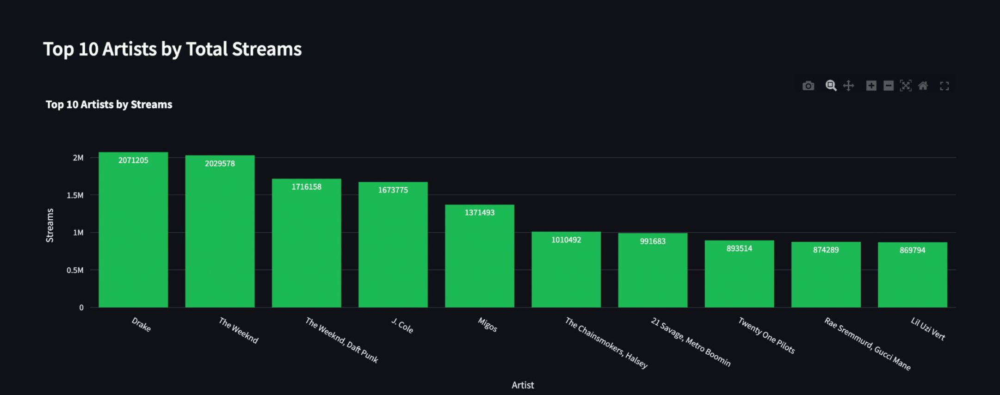

# AWS-Hosted Streamlit Dashboard

## Description
In this project, we developed an interactive Streamlit dashboard of Spotify chart data and hosted it on Amazon EC2. We used various AWS services listed in the next section for both backend and frontend processing.

## Tools and Services Used
- Amazon S3: Store raw data (CSV) from Spotify
- AWS EventBridge: Trigger automated Lambda executions on schedule
- AWS Lambda: Perform scheduled tasks, process requests, scan/filter DynamoDB
- Amazon DynamoDB & RDS: Structured data storage for dashboard
- Amazon EC2: ETL tasks (database) + host Streamlit app for dashboard visualization (display)
- AWS VPC: Secure networking
- AWS IAM: Manage access permissions
- Streamlit: Build interactive web dashboard

## High-Level Cloud Architecture

## Key Procedures
1. Store data into S3 bucket
2. Set up Lambda functions for backend processing
3. Create databases on RDS and DynamoDB
4. Secure network isolation with VPC
5. Develop web app on Streamlit
6. Host web app on EC2

## Step-by-Step Walkthrough
### Step 1: Store Data in S3
1. Create an S3 bucket
2. Upload raw, unprocessed CSV files
3. Organize files into folders
4. Configure access permissions to ensure only authorized services can read the files
5. Use S3 as the central storage point for both raw and processed data

### Step 2: Set Up Lambda Functions
1. Create Lambda functions for each task
2. Set up EventBridge triggers to automate Lambda executions at scheduled intervals
3. Trigger processing jobs on the backend (spotify_database EC2 instance)
4. Extract and transform raw CSV data from S3
5. Load structured data into RDS (for ranking data) and DynamoDB (for metadata)
6. Prepare databases for real-time querying by the Streamlit dashboard

### Step 3: Create RDS & DynamoDB databases
RDS:
1. Create RDS instance inside secure VPC
2. Design relational tables to store ranking data
3. Insert processed data into RDS from Lambda & enable secure access for read/query

DynamoDB:
1. Create DynamoDB table to store metadata
2. Link records via “meta_id” to connect with RDS
3. Allow Lambda functions to scan and filter entries based on user input from Streamlit app

### Step 4: Secure Network with VPC
1. Create a VPC with IPv4 CIDR 10.0.0.0/16 and enabled DNS resolution and hostnames
2. Launch 6 subnets: public subnets for frontend services, and private subnets for compute and database layers
3. Set up a main public route table connected to an Internet Gateway to allow secure outbound internet access
4. Create private route tables with no direct internet access
5. Configure network ACLs and security groups to allow only specific inbound and outbound traffic needed for services like EC2 and RDS

### Step 5: Develop Streamlit App
1. Design a Streamlit web app with region and date selection menus (drop-down)
2. Connect to RDS to retrieve song rankings and streaming counts based on user input
3. Query DynamoDB to fetch detailed song metadata (title, artist) using “meta_id”
4. Merge datasets into a complete view for visualization and analysis
5. Display key statistics (total streams, unique artists, average streams per song, top song)
6. Create interactive charts using Plotly
7. Prepare to deploy app on EC2 for public access

### Step 6: Deploy App on EC2
1. Launch EC2 instance (t3.large)
2. Connect directly to RDS and DynamoDB to query prepared data
3. Provide a web interface (via Streamlit)
4. Publicly expose the Spotify dashboard via IP address for user access

## End Product (Streamlit Dashboard)

## Scalability
- AWS Lambda automatically scales with data uploads
- S3 provides virtually unlimited storage growth
- API Gateway (future improvement) can dynamically handle increasing traffic without downtime

## Conclusion
Through this project, I gained hands-on experience with deploying cloud applications, automating backend workflows with AWS Lambda, and managing secure data storage with RDS and DynamoDB. I also deepened my understanding of integrating frontend dashboards with cloud infrastructure using Streamlit and EC2.
